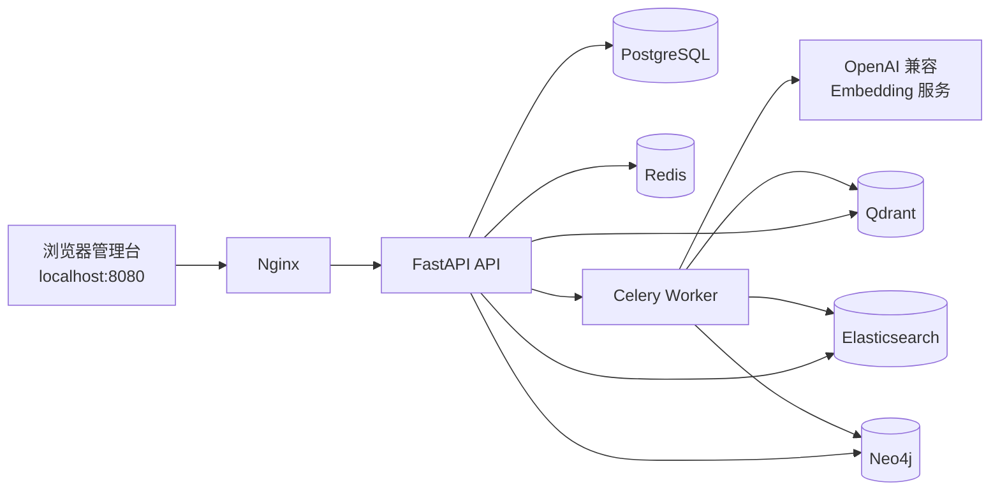

# KnowledgeOps Agent

KnowledgeOps Agent 是一个面向企业知识库与工单协同的本地可运行应用。它在 CoreCoder 的基础上新增独立的 `knowledgeops/` 业务包，提供文档索引、混合检索、图谱检索，以及带人工确认的 Agent 工单操作。

> 本项目保留上游 CoreCoder 的 MIT 许可证和署名信息。KnowledgeOps 的业务代码不写入 `corecoder/`，以保持两个职责边界清晰。

## 功能概览

- 知识库管理：创建知识库、上传文本文件、查询文档状态。
- 异步索引：Celery Worker 在后台完成分块、Embedding、Qdrant 向量写入和 Elasticsearch 关键词写入。
- 混合检索：语义召回与 BM25 召回经 RRF 融合，再由确定性重排器排序，并返回可引用的文档块。
- GraphRAG：从文档块抽取实体关系并写入 Neo4j，支持按实体关系检索关联文档块。
- Agent：使用 OpenAI 兼容的 LLM Function Calling 自主选择知识库与工单工具；创建工单只会准备草稿，必须经过用户二次确认。
- 工单协同：员工可标准化建单、查看 SLA 与活动时间线、补充信息，并在已解决后确认关闭或重新打开；服务台可领取、转派、请求补充并标记解决。
- 全局搜索与个人工作项：一次查询聚合本地知识资料、规则识别的图谱实体、当前员工的历史对话和工单；支持收藏、最近访问，以及 Agent 回答反馈。
- 管理前端：通过 `http://localhost:8080` 操作知识库、文档索引、图谱检索、工单和 Agent 对话。

## 系统架构



## 目录说明

| 路径 | 职责 |
| --- | --- |
| `knowledgeops/api/` | FastAPI 应用、依赖注入和路由。 |
| `knowledgeops/services/` | 知识库、文档、索引和工单业务服务。 |
| `knowledgeops/rag/` | 向量检索、关键词检索、RRF 融合和重排。 |
| `knowledgeops/graphrag/` | Neo4j 图存储、实体抽取和图谱检索。 |
| `knowledgeops/agents/` | LangGraph 工作流、意图路由和工单工具。 |
| `knowledgeops/tasks/` | Celery 应用、异步索引任务和运行时工厂。 |
| `knowledgeops/frontend/` | 静态管理前端。 |
| `tests/` | 单元、接口、工作流和集成测试。 |
| `docs/` | 阶段学习日志与最终交付说明。 |

## 运行前提

- Windows 10/11、Docker Desktop（WSL2 后端）和 Conda。
- Python `3.11`，项目已验证环境名为 `myagent`。
- 一个可访问的 OpenAI 兼容 Embedding 服务。
- Docker Desktop 需要有足够资源运行 PostgreSQL、Redis、Qdrant、Elasticsearch、Neo4j、API、Worker 和 Nginx。

敏感配置只保存在本地 `.env`，不要提交、截图或写入日志。至少配置以下变量名：

```dotenv
OPENAI_API_KEY=<你的密钥>
OPENAI_BASE_URL=<你的 OpenAI 兼容服务地址>
NEO4J_PASSWORD=<本地 Neo4j 密码>
```

可以按模型服务的实际要求额外配置 `EMBEDDING_MODEL` 和 `EMBEDDING_DIMENSIONS`。模型维度发生变化时，必须使用新的 Qdrant collection，或先重建旧 collection，不能将不同维度的向量写入同一 collection。

## 快速启动

```powershell
Set-Location D:\Agent\CoreCoder
conda activate myagent
docker build --tag knowledgeops-agent:local .
docker compose up -d
docker compose ps
```

`docker-compose.yml` 使用的是 `image: knowledgeops-agent:local`，因此 `docker compose build` 显示 `No services to build` 是预期行为。后端代码或 Python 依赖变更后，使用下面的方式更新：

```powershell
docker build --tag knowledgeops-agent:local .
docker compose up -d --force-recreate migrate api worker
```

Dockerfile 会先单独安装 `pyproject.toml` 中的运行时依赖，再复制业务代码。因此只修改 Python 代码时，Docker 会复用依赖层；不要添加 `--no-cache`，除非需要排查依赖缓存本身的问题。服务确认正常后，可按需执行 `docker image prune -f` 清理未被容器引用的旧镜像，切勿对本项目执行带 `--volumes` 的清理命令。

前端目录以只读卷挂载到 Nginx。仅修改 `knowledgeops/frontend/` 或 `nginx/default.conf` 后无需重建项目镜像；必要时执行：

```powershell
docker compose restart frontend
```

## 访问入口

| 地址 | 用途 |
| --- | --- |
| `http://localhost:8080` | KnowledgeOps 管理前端。 |
| `http://localhost:8080/health` | 经 Nginx 代理的健康检查。 |
| `http://localhost:8080/api/v1/health` | API 健康检查。 |
| `http://localhost:7474` | Neo4j Browser。 |
| `bolt://localhost:7687` | Neo4j Bolt 连接地址。 |

## 核心流程

### 文档索引

```text
上传文档
  -> uploaded
  -> POST /documents/{document_id}/index
  -> Redis 投递任务
  -> Celery Worker 分块和 Embedding
  -> Qdrant + Elasticsearch + Neo4j 写入
  -> ready 或 failed
```

只有索引依赖均成功后，文档状态才会变为 `ready`。前端轮询 `ready` 或 `failed` 作为终止状态。

### Agent 工单保护

```text
POST /agent/turns
  -> LangGraph 识别意图
  -> 知识问答 / 工单查询 / 创建工单草案
  -> 创建工单时中断并返回 confirmation_required
  -> POST /agent/turns/{thread_id}/confirmation
  -> approved=true 才创建工单；false 则取消
```

确认请求使用登录会话中的同一用户身份。服务端从 HttpOnly Session Cookie 解析用户，防止其他用户替原发起人确认工单。

## API 摘要

所有接口的前缀均为 `/api/v1`。除健康检查与认证接口外，业务接口均使用登录会话识别当前用户。

| 方法 | 路径 | 说明 |
| --- | --- | --- |
| `GET` | `/health` | 服务健康检查。 |
| `GET` / `POST` | `/knowledge-bases` | 查询或创建知识库。 |
| `POST` | `/knowledge-bases/{id}/documents` | 上传文本文件。 |
| `GET` | `/knowledge-bases/{id}/documents` | 查询知识库中的文档元数据。 |
| `POST` | `/documents/{id}/index` | 投递异步索引任务，返回 `202`。 |
| `GET` | `/documents/{id}` | 查询文档索引状态。 |
| `POST` | `/knowledge-bases/{id}/search` | 混合检索。 |
| `POST` | `/knowledge-bases/{id}/graph/search` | GraphRAG 检索。 |
| `POST` | `/agent/turns` | 发起 Agent 对话。 |
| `POST` | `/agent/turns/{thread_id}/confirmation` | 确认或取消待确认工单。 |
| `GET` | `/tickets` | 查询当前员工的工单，支持状态、关键词和分页。 |
| `POST` | `/tickets` | 创建标准化服务请求。 |
| `GET` | `/tickets/{id}` | 读取工单详情与活动时间线。 |
| `POST` | `/tickets/{id}/comments` | 为未关闭工单补充信息。 |
| `POST` | `/tickets/{id}/confirm-resolution` | 确认已解决工单并关闭。 |
| `POST` | `/tickets/{id}/reopen` | 填写原因后重新打开已解决工单。 |
| `GET` | `/service-desk/tickets` | “待我处理”查询待领取、我的或全部处理队列。 |
| `POST` | `/service-desk/tickets/{id}/accept` | 服务人员领取待受理工单。 |
| `POST` | `/service-desk/tickets/{id}/assign` | 服务人员转派未关闭工单。 |
| `POST` | `/service-desk/tickets/{id}/request-information` | 请求申请人补充信息。 |
| `POST` | `/service-desk/tickets/{id}/priority` | 调整处理中工单的优先级并记录原因。 |
| `POST` | `/service-desk/tickets/{id}/escalate` | 升级处理中工单并记录原因。 |
| `POST` | `/service-desk/tickets/{id}/resolve` | 记录处理结果并标记已解决。 |
| `GET` | `/notifications` | 查询当前员工的通知、未读数和分页结果。 |
| `POST` | `/notifications/{id}/read` | 将一条属于当前员工的通知标为已读。 |
| `POST` | `/notifications/read-all` | 将当前员工全部未读通知标为已读。 |
| `GET` | `/search` | 聚合当前员工可见的本地资料、图谱实体、历史对话和工单。 |
| `GET` / `POST` | `/favorites` | 查询或保存当前员工的收藏。 |
| `DELETE` | `/favorites/{type}/{id}` | 取消当前员工的一个收藏。 |
| `GET` / `POST` | `/recent-visits` | 查询或记录当前员工最近访问的工作项。 |
| `POST` | `/agent-messages/{id}/feedback` | 对本人 Agent 回答提交或更新结构化反馈。 |

## 演示步骤

1. 打开 `http://localhost:8080`，创建或选择一个知识库。
2. 在“文档索引”上传文本，等待状态显示为 `ready`。
3. 在“图谱检索”中提问与已索引内容相关的问题，确认返回关联文档块。
4. 在“Agent 对话”中选择知识库并发起知识问答，检查回答和引用来源。
5. 输入创建工单请求，确认页面先出现确认按钮；点击“确认创建工单”后，再使用同一操作人查询工单。

## 验证

```powershell
Set-Location D:\Agent\CoreCoder
conda activate myagent
python -m pytest -q
python -m ruff check knowledgeops tests
git diff --check
Invoke-RestMethod http://localhost:8080/health
docker compose ps
```

最终验收基线：`199 passed, 2 warnings`，且 Ruff 输出 `All checks passed!`。两个 warning 均为已知的测试环境提示：Starlette TestClient 的第三方弃用提示，以及内存模式 Qdrant 中 payload index 无效的提示。生产 Qdrant 仍需要 payload index，因此不要为消除 warning 删除该逻辑。

## 当前边界

- 已实现注册、登录、HttpOnly Cookie 会话和服务端角色鉴权。生产部署必须通过 `AUTH_JWT_SECRET` 配置独立的高熵密钥；`X-Actor` 与 `X-Role` 不再参与生产鉴权。
- Agent 的 `MemorySaver` 用于单 API 实例中的待确认对话；API 重启或多实例部署时，应替换为持久化共享 checkpointer。
- 当前实体抽取器为规则型实现，适用于可复现演示；生产环境可在保持图存储接口不变的前提下替换为模型抽取器。
- Elasticsearch 安全功能在本地 Compose 环境中关闭，仅适合本地开发与演示。

完整交付内容请阅读：[最终交付说明](docs/knowledgeops-delivery.md)、[第五阶段学习日志](docs/knowledgeops-learning-log-phase5-cn.md)、[第六阶段学习日志](docs/knowledgeops-learning-log-phase6.md)、[第七阶段学习日志](docs/knowledgeops-learning-log-phase7.md)、[待我处理学习日志](docs/knowledgeops-learning-log-phase15-service-desk.md)、[通知中心学习日志](docs/knowledgeops-learning-log-phase16-notifications.md) 和 [个人工作项与反馈学习日志](docs/knowledgeops-learning-log-phase17-engagement.md)。

## 许可证与归属

本项目沿用上游 CoreCoder 的 [MIT License](LICENSE)。保留上游项目的版权和署名信息。
