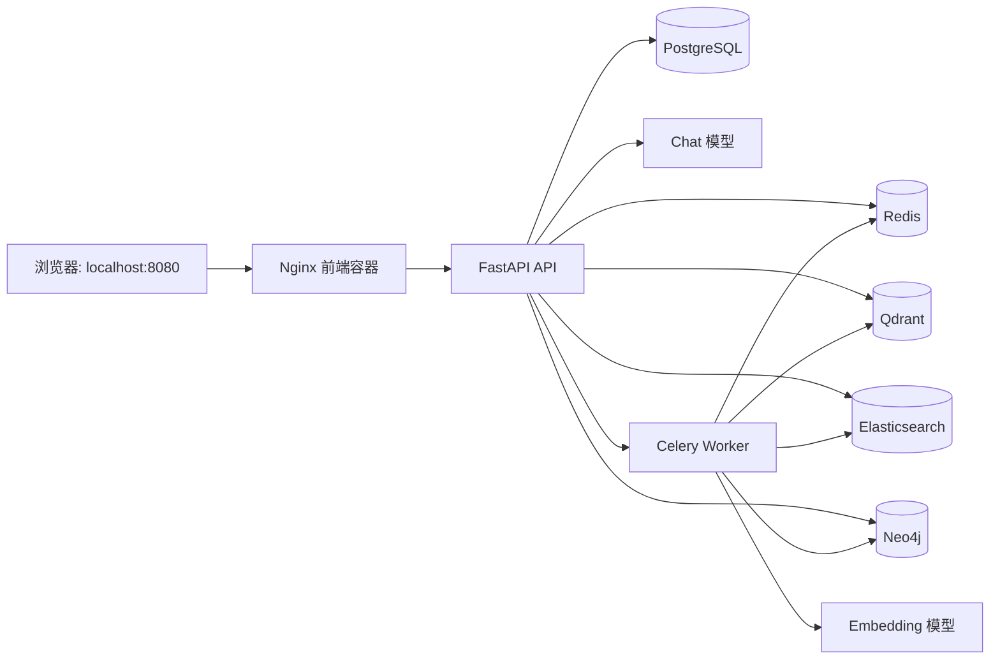

# KnowledgeOps Agent

> 企业知识库与工单协同 Agent。把团队资料变成可检索知识，让员工在同一平台完成问答、建单、跟进与服务台协作。

KnowledgeOps Agent 是独立的企业知识库与工单协同项目，面向本地演示、学习和作品集展示，提供真实的登录会话、知识库索引、混合检索、GraphRAG、LLM Function Calling Agent 和工单协同闭环。

---

## 目录

- [核心能力](#核心能力)
- [技术栈](#技术栈)
- [系统架构](#系统架构)
- [环境要求](#环境要求)
- [快速开始](#快速开始)
  - [第 1 步：准备环境变量](#第-1-步准备环境变量)
  - [第 2 步：构建后端镜像](#第-2-步构建后端镜像)
  - [第 3 步：启动完整系统](#第-3-步启动完整系统)
  - [第 4 步：验证服务](#第-4-步验证服务)
  - [第 5 步：注册并开始使用](#第-5-步注册并开始使用)
- [首次演示流程](#首次演示流程)
- [角色与权限](#角色与权限)
- [核心设计](#核心设计)
- [目录结构](#目录结构)
- [开发、测试与更新镜像](#开发测试与更新镜像)
- [常见问题](#常见问题)
- [学习路线](#学习路线)
- [当前边界](#当前边界)

---

## 核心能力

- **企业知识库**：创建知识库，导入文本、PDF、DOCX、Markdown、TXT、HTML 文件或公开网页；查看文档和索引状态。
- **异步文档索引**：上传后的资料由 Celery Worker 异步完成解析、分块、Embedding、关键词索引和图谱写入，状态为 `uploaded -> indexing -> ready/failed`。
- **混合检索 RAG**：Qdrant 负责向量语义召回，Elasticsearch 负责 BM25 关键词召回，结果经 RRF 融合和确定性重排后返回可引用的文档片段。
- **图谱检索 GraphRAG**：从文档片段抽取实体关系并写入 Neo4j，可按实体和关系寻找关联片段。
- **智能助手**：使用 OpenAI 兼容的 Chat 模型与原生 Function Calling，在知识库问答、我的工单查询、工单详情和建单草稿之间选择工具；不支持 Function Calling 的模型会降级为规则路由。
- **工单协同**：员工可建单、补充信息、确认解决或重新打开；服务台可领取、转派、请求补充、调整优先级、升级和解决工单。
- **工作台与个人工作项**：展示近期工单、常用知识库、会话；提供通知中心、全局搜索、收藏、最近访问和 Agent 回答反馈。
- **登录与权限**：注册、登录、登出、HttpOnly 会话 Cookie、个人中心与角色控制；首个注册用户自动成为管理员。

## 技术栈

| 层级 | 采用技术 | 在项目中的职责 |
| --- | --- | --- |
| 前端 | React 18 + TypeScript + Vite + Zustand + Nginx | 组件化管理台、类型化 API 调用、前端状态与 `/api` 反向代理 |
| API | FastAPI + Pydantic | REST 接口、身份校验、参数验证和依赖注入 |
| 业务数据 | PostgreSQL 16 + SQLAlchemy Async + Alembic | 用户、会话、知识库、文档、工单、通知和审计数据 |
| 异步任务 | Celery + Redis | 文档索引任务投递、执行与结果记录 |
| 向量检索 | Qdrant | 文档片段向量存储与语义召回 |
| 关键词检索 | Elasticsearch | BM25 关键词召回 |
| 图谱 | Neo4j | 实体、关系和文档片段关联 |
| LLM | OpenAI 兼容 Chat / Embedding API | Agent Function Calling、回答生成和向量化 |
| 测试与检查 | pytest + Ruff | 单元、接口、工作流和静态质量验证 |

## 系统架构



文档索引是异步链路：浏览器提交资料后，API 只保存原始数据并投递任务；Worker 在后台完成耗时计算。Agent 对话是在线链路：API 根据当前登录用户组装工具、调用 Chat 模型、执行受控工具并返回结果。

## 环境要求

| 软件或服务 | 建议版本 | 用途 |
| --- | --- | --- |
| Docker Desktop | 当前稳定版，启用 WSL2 | 启动全部服务与存储 |
| Python | 3.11 | 本地运行测试或后端开发 |
| Node.js | 20 或更高版本（仅本地前端开发需要） | 运行 Vite、类型检查与前端生产构建 |
| 可用的 Chat 模型 | 支持 OpenAI Chat Completions；推荐支持 Function Calling | Agent 对话与工具选择 |
| 可用的 Embedding 模型 | OpenAI 兼容接口 | 文档向量化与语义检索 |

Docker Compose 会使用端口 `8080`、`7474` 和 `7687`；容器网络内部还会使用 PostgreSQL、Redis、Qdrant 与 Elasticsearch 的默认端口。启动前请确认这些端口没有被其他程序占用。

> Chat 模型和 Embedding 模型是两类不同能力。Chat 模型负责理解问题、生成回答和发起工具调用；Embedding 模型负责把文档与查询转换为向量。两者可以来自同一个或不同的服务商。

## 快速开始

以下命令以 Windows PowerShell 为例，在项目根目录执行。

### 第 1 步：准备环境变量

复制模板并编辑本地配置：

```powershell
Copy-Item .env.example .env
notepad .env
```

至少替换以下值：

- `CHAT_MODEL`、`CHAT_BASE_URL`、`CHAT_API_KEY`
- `EMBEDDING_MODEL`、`EMBEDDING_DIMENSIONS`、`EMBEDDING_BASE_URL`、`EMBEDDING_API_KEY`
- `NEO4J_PASSWORD`
- `AUTH_JWT_SECRET`，必须使用长度不少于 32 位的随机字符串

`EMBEDDING_DIMENSIONS` 必须与 Embedding 模型实际输出维度一致。调整该维度或更换向量模型后，应使用新的 Qdrant collection，或在确认无用数据后重建旧 collection。

### 第 2 步：构建后端镜像

```powershell
docker build --tag knowledgeops-agent:local .
```

根目录 `Dockerfile` 负责构建 API、迁移和 Worker 共用的 Python 镜像。若下载依赖时网络较慢，直接重试此命令即可；不要默认加入 `--no-cache`。

### 第 3 步：启动完整系统

```powershell
docker compose up -d
docker compose ps
```

首次启动会依次拉取或构建镜像、启动存储服务、执行 `migrate` 数据库迁移，再启动 API、Worker 和前端。`migrate` 在成功后显示为已退出是正常现象；其余业务容器应处于运行状态。

### 第 4 步：验证服务

```powershell
Invoke-RestMethod http://localhost:8080/health
docker compose ps
```

健康检查应返回：

```json
{"status":"ok","service":"knowledgeops-api"}
```

访问入口：

| 地址 | 用途 |
| --- | --- |
| `http://localhost:8080` | KnowledgeOps 管理台 |
| `http://localhost:8080/health` | 经 Nginx 代理的 API 健康检查 |
| `http://localhost:7474` | Neo4j Browser |
| `bolt://localhost:7687` | Neo4j Bolt 连接地址 |

### 第 5 步：注册并开始使用

1. 打开 `http://localhost:8080`，注册第一个账号。第一个账号自动拥有管理员角色。
2. 登录后进入“知识库”，新建一个知识库。
3. 打开该知识库，上传本地文件、导入网页，或添加一段文本资料。
4. 等待文档状态变为 `ready` 后，在“智能助手”中选择知识库并提问。
5. 在“创建工单”提交服务请求；管理员可在“用户与权限”中将其他账号设为服务台角色，再用该账号进入“待我处理”。

## 首次演示流程

建议用下面的顺序完成一次端到端演示，每一步都能对应到实际业务价值。

1. **创建知识库**：建立“工程规范”或“IT 支持”知识库。
2. **导入资料**：上传一篇包含明确流程的 TXT、Markdown 或 PDF 文档，查看状态从 `uploaded` 到 `ready`。
3. **验证检索**：在“全局搜索”或“图谱检索”中输入文档中的关键词，确认能找到来源资料。
4. **验证 Agent**：在“智能助手”中询问资料中的具体流程，观察回答中的引用；再询问“我的未关闭工单”。
5. **验证受控建单**：输入“帮我创建一个无法连接企业 VPN 的工单”，先检查 Agent 生成草稿，再主动确认创建。
6. **验证服务台协作**：使用服务台账号进入“待我处理”，领取工单、请求补充或解决；回到员工账号确认通知与状态变化。

## 角色与权限

| 角色 | 主要能力 |
| --- | --- |
| 员工 `employee` | 使用共享知识库、发起 Agent 对话、创建并跟进属于自己的工单、管理个人收藏和最近访问 |
| 服务台 `service_desk` | 包含员工能力，并可查看和处理服务台队列中的工单 |
| 管理员 `admin` | 包含服务台能力，并可在“用户与权限”中分配角色 |

身份由服务端签发的 HttpOnly Cookie 识别。工单、会话、通知、收藏、最近访问和 Agent 反馈都按当前用户限制访问；知识库当前是组织共享资源，不提供多租户隔离。

## 核心设计

### 文档索引与混合检索

```text
本地文件 / 网页 / 文本
  -> API 保存 Document
  -> 投递 Celery 索引任务
  -> 解析与分块
  -> Embedding 向量写入 Qdrant
  -> 文本写入 Elasticsearch
  -> 实体关系写入 Neo4j（可选）
  -> Document 状态 ready 或 failed

查询
  -> 向量召回 + BM25 召回
  -> RRF 融合
  -> TokenOverlapReranker 重排
  -> 返回可引用片段
```

这样拆分可以避免把语义相似度与关键词分数直接相加。RRF 只使用各召回器的排名，因此不同评分尺度不会互相污染；重排器只在候选集上工作，未来可替换为更强的模型。

### Agent 与人工确认

```text
用户消息
  -> Chat 模型识别是否需要工具
  -> 知识库检索 / 我的工单查询 / 工单详情 / 建单草稿
  -> 需要写入时只返回草稿
  -> 用户在页面确认
  -> 服务端创建工单并记录活动
```

模型只能调用 `search_knowledge_base`、`list_my_tickets`、`get_my_ticket_detail` 和 `prepare_ticket_draft`。其中 `prepare_ticket_draft` 不会写数据库，真正创建必须经过用户确认，避免模型直接执行高影响操作。

### 工单状态机

```text
待受理(open)
  -> 处理中(in_progress)
  -> 待补充(awaiting_requester)
  -> 已解决(resolved)
  -> 已关闭(closed)
```

状态流转由后端服务统一校验并记录活动时间线，前端只请求操作，不能直接修改状态标签。

## 目录结构

```text
KnowledgeOps-Agent/
├── knowledgeops/
│   ├── api/                 # FastAPI 应用、路由与依赖注入
│   ├── agents/              # LangGraph 工作流、Function Calling 和工具
│   ├── services/            # 知识库、索引、工单、会话等业务服务
│   ├── repositories/        # 数据访问层
│   ├── models/              # SQLAlchemy ORM 模型
│   ├── schemas/             # Pydantic 请求与响应模型
│   ├── rag/                 # 解析、Embedding、混合检索、融合和重排
│   ├── graphrag/            # Neo4j 图存储、实体抽取与图谱检索
│   ├── tasks/               # Celery 应用、索引与 Agent 运行时工厂
│   ├── evaluation/          # Recall@k、MRR 和延迟评估
│   └── frontend/            # React + TypeScript 源码与前端 Dockerfile
├── migrations/              # Alembic 数据库迁移
├── nginx/                   # Nginx 反向代理配置
├── tests/                   # 单元、接口、工作流和集成测试
├── docs/learning/           # 中文分阶段学习路线
├── docker-compose.yml       # 完整容器编排
├── Dockerfile               # Python 后端镜像
└── .env.example             # 非敏感配置模板
```

## 开发、测试与更新镜像

### 本地测试

已安装本地开发依赖后，可以执行：

```powershell
python -m pytest -q
python -m ruff check knowledgeops tests
git diff --check
```

测试默认使用可替换的假实现或本地测试数据库，不会要求真实调用 LLM。涉及真实模型、Qdrant、Elasticsearch 或 Neo4j 的演示应通过 Docker Compose 环境验证。

### 修改后端

修改 `knowledgeops/` 中的 Python 代码、依赖或迁移后：

```powershell
docker build --tag knowledgeops-agent:local .
docker compose up -d --force-recreate migrate api worker
```

### 修改前端

前端源码位于 `knowledgeops/frontend/src/`。Dockerfile 会先使用 Node 构建 Vite 产物，再仅将 `dist/` 复制到 Nginx 最终镜像。修改 React、TypeScript 或样式后，需要：

```powershell
Set-Location knowledgeops/frontend
npm ci
npm run check
npm run build
Set-Location ../..
docker compose build frontend
docker compose up -d --force-recreate --no-deps frontend
```

`npm ci` 只在本地前端开发或验证时需要；只运行 Docker Compose 时，Node 构建会在 Docker 的构建阶段完成。随后在浏览器按 `Ctrl + F5`。常规构建会复用缓存；不要为了普通代码修改使用 `--no-cache`。如确认不存在需要保留的旧镜像，可单独执行 `docker image prune -f` 清理悬空镜像，不要执行带 `--volumes` 的全局清理命令。

## 常见问题

**Q：执行 `docker compose up -d` 后前端打不开？**

先执行 `docker compose ps`，确认 `frontend` 和 `api` 正在运行；再访问 `http://localhost:8080/health`。若端口 `8080` 被占用，修改 Compose 的前端端口映射后重新启动。

**Q：页面显示“API 未连接”或知识库空白？**

确认 API 健康检查正常，再查看浏览器开发者工具中的 Network 请求。前端代码改动后必须重新执行 `docker compose build frontend` 和前端容器重建；仅刷新浏览器不会把宿主机文件复制进已有镜像。

**Q：资料一直停在 `indexing`？**

检查 Worker 是否运行：`docker compose ps worker`，再查看 `docker compose logs --tail 100 worker`。同时核对 Embedding 模型的地址、密钥和维度，以及 Redis、Qdrant、Elasticsearch、Neo4j 是否可用。

**Q：Agent 只能处理固定话术或提示模型不可用？**

检查 `CHAT_MODEL`、`CHAT_BASE_URL` 和 `CHAT_API_KEY`。若模型不支持 Function Calling，系统会尝试规则降级；要展示完整的工具选择能力，应使用支持 OpenAI Function Calling 协议的模型。

**Q：为什么切换用户后看不到其他人的工单？**

这是权限设计。工单、会话和个人工作项按当前登录用户隔离；服务台角色只能在自己的处理权限范围内查看队列。

## 学习路线

面向项目新手的中文学习文档位于 [docs/learning/README.md](docs/learning/README.md)。建议按阶段阅读和复现：

1. 项目基础与领域建模
2. 知识库导入与异步索引
3. 混合检索与 GraphRAG
4. Agent、聊天模型与 Function Calling
5. 工单协同与服务台状态机
6. 员工工作台、搜索、通知与反馈
7. 登录、权限与用户隔离
8. 前端模块化、容器化与排错

每个阶段都包含目标、设计取舍、关键文件、验证步骤、常见错误和面试表达；原始逐次开发日志仍保留在 `docs/` 中供追溯。

## 当前边界

- 当前适合本地开发、学习、作品集展示和小范围演示；生产部署还需要补充 HTTPS、密钥管理、监控告警、备份恢复和资源限流。
- Agent 待确认状态使用进程内 `MemorySaver`，API 重启或多实例部署后应替换为持久化、共享的 LangGraph checkpointer。
- 知识库是组织共享资源，尚未提供企业级多租户、文档 ACL 和部门级数据范围控制。
- Elasticsearch 在本地 Compose 中关闭安全认证，仅用于开发与演示。
- 图谱实体抽取当前使用规则实现，便于稳定复现；生产场景可在不改变图存储接口的前提下替换为模型抽取器。

## 许可证与归属

本项目遵循 [MIT License](./LICENSE)。KnowledgeOps 业务代码位于 `knowledgeops/`，部署、迁移、测试和学习文档位于项目根目录的对应目录中。
