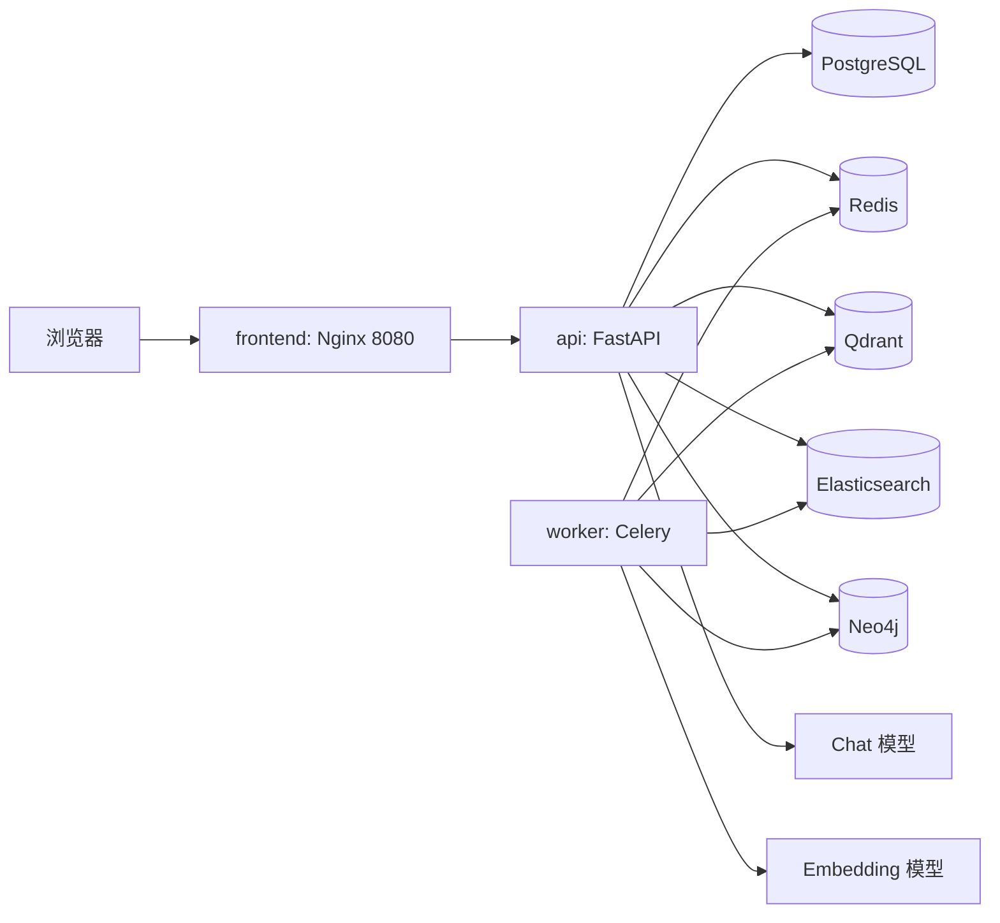

# 阶段 9：运行模式、镜像更新与离线测评

## 用户问题

项目能在浏览器打开，并不意味着它已经具备可复现的运行方式。企业知识库 Agent 同时依赖数据库、任务队列、检索引擎、图数据库和模型服务；如果不知道谁负责什么、什么时候需要重建镜像、为什么测评还要启动 Qdrant，就容易把环境问题误判为代码问题。

本阶段的目标是建立一张清晰的运行地图：用 Docker Compose 交付完整系统，用 Vite 提高前端修改效率，用离线测评验证检索与回答能力，并能区分项目故障与外部模型服务故障。

## 设计结论

| 场景 | 推荐启动方式 | 原因 |
| --- | --- | --- |
| 第一次演示、验收、完整业务使用 | `docker compose up -d` | 所有依赖都处于与交付环境一致的容器网络中。 |
| 修改 React 页面 | Docker 后端 + `npm run dev` | 保留真实 API 和数据服务，同时获得 Vite 热更新。 |
| 修改 Python API、Worker、依赖或迁移 | 重建 Python 镜像后重启相关服务 | Compose 运行的是镜像中的代码，宿主机源码不会自动进入既有容器。 |
| 仅进行检索离线测评 | 启动 Qdrant 和 Elasticsearch，再运行测评 | 测评程序仍要读取真实向量和 BM25 索引。 |

这里的核心取舍是：**交付一致性优先使用容器，修改效率优先使用本地热更新**。两者不是互相替代，而是服务于不同阶段。

## 运行地图



- `frontend` 是对浏览器开放的唯一日常入口，地址为 `http://localhost:8080`。
- `api` 处理用户立即等待的请求，例如登录、创建知识库、查看工单和 Agent 对话。
- `worker` 消费 Redis 中的索引任务，执行解析、分块和向量化，因此必须运行才能让资料从 `indexing` 变成 `ready`。
- `migrate` 是一次性容器，只在启动时执行数据库迁移。它显示 `exited (0)` 表示任务成功完成。
- Chat 模型负责回答和工具选择；Embedding 模型负责文档与查询向量化。二者的余额、网络和模型能力是外部依赖，不由 Docker 容器提供。

## 复现与验证

### 1. 启动完整系统

在根目录准备好 `.env` 后执行：

```powershell
docker build --tag knowledgeops-agent:local .
docker compose up -d
docker compose ps
Invoke-RestMethod http://localhost:8080/health
```

预期结果：`frontend`、`api`、`worker` 与各数据服务为运行状态；`migrate` 成功退出；健康检查返回 `status: ok`。然后在 `http://localhost:8080` 注册账号、导入资料，并等待文档状态变为 `ready`。

暂停和恢复时使用：

```powershell
docker compose stop
docker compose start
```

不要把 `docker compose down -v` 当作普通重启命令。它会删除命名数据卷，等同于清空本地数据库和检索索引。

### 2. 用 Vite 调试前端

先让 Docker 完整系统保持运行，在另一个终端执行：

```powershell
Set-Location knowledgeops/frontend
npm ci
npm run dev
```

访问 `http://127.0.0.1:5173`。`vite.config.ts` 中的 `/api` 代理会把请求转发到 Docker 的 `http://localhost:8080`，使浏览器继续经过 Nginx、FastAPI 和 Cookie 登录链路。这样页面源代码在本地实时刷新，后端仍是真实运行环境。

Vite 进程停止后，`5173` 也会停止；它不会修改 `8080` 上已有的前端镜像。确认效果后，执行生产构建和镜像重建：

```powershell
Set-Location knowledgeops/frontend
npm run check
npm run build
Set-Location ../..
docker compose build frontend
docker compose up -d --force-recreate --no-deps frontend
```

### 3. 后端或 Worker 变更

修改 Python 代码、Python 依赖或数据库迁移后，在根目录执行：

```powershell
docker build --tag knowledgeops-agent:local .
docker compose up -d --force-recreate migrate api worker
```

修改迁移文件时，先确认没有同名或重复迁移，再让 `migrate` 成功完成后检查 API 日志。这个顺序确保 API 不会连接到旧表结构。

### 4. 执行离线测评

测评先读取数据集，再向当前知识库中的索引发起检索请求。只测检索时，最小前置条件是：

```powershell
docker compose up -d qdrant elasticsearch
docker compose ps
```

如果测评命令使用 `docker compose run --rm --no-deps`，要特别理解 `--no-deps`：它阻止 Compose 自动启动服务，但不会消除 Qdrant 和 Elasticsearch 的依赖。包含多跳回答或 Agent 评测时，还需要 Chat 模型；向量、混合检索需要 Embedding 模型。

## 常见错误与判断方法

| 现象 | 首先检查 | 通常原因 |
| --- | --- | --- |
| 文档一直是 `indexing` | `docker compose ps worker` 与 `docker compose logs --tail 100 worker` | Worker、Redis、Embedding、检索服务任一环节不可用。 |
| `No address associated with hostname` | Qdrant/Elasticsearch 是否运行 | 容器网络中找不到未启动的服务名。 |
| Qdrant `502` 或连接异常 | 服务日志和本机内存 | 服务尚未就绪、容器重启或资源不足。 |
| `402 Insufficient Balance` | 模型服务商的余额与密钥 | Chat/Embedding 服务拒绝请求；不是本项目代码错误。 |
| 本地页面 API 失败 | 是否从 `127.0.0.1:5173` 访问，Docker 是否运行 | 没有经过 Vite `/api` 代理，或 `8080` 后端未启动。 |
| 改了页面但 `8080` 未变化 | 是否只运行了 Vite | Vite 热更新只作用于 `5173`；要更新交付镜像需重建 `frontend`。 |

## 面试表达

“我把本地运行分成两条路径：完整演示用 Docker Compose，让 Nginx、FastAPI、Celery 和多类数据服务在同一网络中工作；前端开发用 Vite 的 `/api` 代理复用 Docker 后端，获得热更新但不绕过真实鉴权。文档索引是异步任务，所以我会把 API 可用和 Worker 可用分开验证。离线评测不是纯脚本，它需要连接已经建立的向量和 BM25 索引；当出现 402 时，我会判断为模型服务余额问题，而不是盲目修改检索代码。”

## 历史记录

本章基于当前 `docker-compose.yml`、前端 Vite 配置和离线评测脚本整理。更早期的测评数据集、报告与优化过程保留在 `docs/evaluation/`、`evaluation-results/` 和 `docs/` 根目录中，阅读时应区分“某一版实验结果”与“当前运行方式”。
